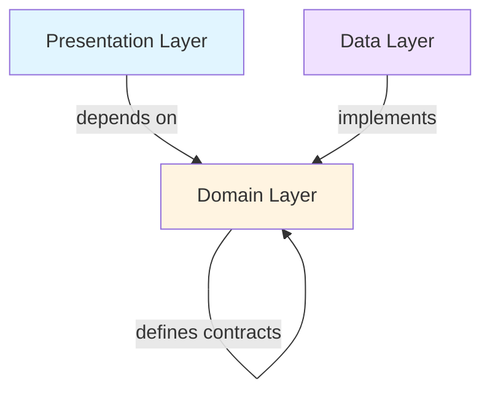

## Overview

Softbee is a Flutter-based SaaS application for beekeeping management, built following **Clean Architecture** principles and modern Flutter best practices. The architecture emphasizes separation of concerns, testability, and maintainability through clear layer boundaries and dependency management.

<Note>
The application uses **Flutter** for cross-platform UI, **Riverpod** for state management, and **Clean Architecture** to separate business logic from UI and data concerns.
</Note>

## High-Level Architecture

The application follows a feature-based modular structure with shared core components:

```
lib/
├── core/              # Shared utilities and infrastructure
│   ├── error/         # Failure classes and error handling
│   ├── network/       # HTTP client configuration
│   ├── router/        # Navigation and routing
│   ├── theme/         # UI theming
│   ├── usecase/       # Base use case abstraction
│   └── widgets/       # Reusable UI components
└── feature/           # Feature modules
    ├── apiaries/      # Apiary management
    ├── auth/          # Authentication & authorization
    ├── beehive/       # Beehive tracking
    ├── inventory/     # Inventory management
    └── monitoring/    # Monitoring & inspections
```

<CardGroup cols={2}>
  <Card title="Core Layer" icon="cube">
    Shared utilities, base classes, error handling, networking, and routing configuration
  </Card>
  <Card title="Feature Modules" icon="puzzle-piece">
    Self-contained features following Clean Architecture with Domain, Data, and Presentation layers
  </Card>
</CardGroup>

## Layer Architecture

Each feature module is organized into three distinct layers:



### Domain Layer (Business Logic)

The innermost layer containing business entities, repository contracts, and use cases. This layer has **no dependencies** on external frameworks.

**Structure:**
- **Entities**: Pure Dart classes representing business objects
- **Repositories**: Abstract interfaces defining data operations
- **Use Cases**: Single-responsibility business logic units

**Example from `lib/feature/apiaries/domain/`:**

```dart
// Entity
class Apiary {
  final String id;
  final String userId;
  final String name;
  final String? location;
  final int? beehivesCount;
  final bool treatments;
  final DateTime? createdAt;
  // ...
}

// Repository Contract
abstract class ApiaryRepository {
  Future<Either<Failure, List<Apiary>>> getApiaries();
  Future<Either<Failure, Apiary>> createApiary(...);
  // ...
}

// Use Case
class GetApiariesUseCase implements UseCase<List<Apiary>, NoParams> {
  final ApiaryRepository repository;
  
  GetApiariesUseCase(this.repository);
  
  @override
  Future<Either<Failure, List<Apiary>>> call(NoParams params) async {
    return await repository.getApiaries();
  }
}
```

### Data Layer (Data Management)

Implements repository contracts and handles data retrieval from remote APIs and local storage.

**Structure:**
- **Data Sources**: Remote (API) and local (cache/storage) data access
- **Models**: Data transfer objects with JSON serialization
- **Repository Implementations**: Concrete implementations of domain repositories

**Example from `lib/feature/apiaries/data/`:**

```dart
// Repository Implementation
class ApiaryRepositoryImpl implements ApiaryRepository {
  final ApiaryRemoteDataSource remoteDataSource;
  final AuthLocalDataSource localDataSource;

  @override
  Future<Either<Failure, List<Apiary>>> getApiaries() async {
    try {
      final token = await localDataSource.getToken();
      if (token == null) {
        return const Left(AuthFailure('No authentication token found.'));
      }
      final result = await remoteDataSource.getApiaries(token);
      return Right(result);
    } catch (e) {
      return Left(ServerFailure(e.toString()));
    }
  }
}
```

### Presentation Layer (UI)

Handles user interface, user input, and state management using Riverpod.

**Structure:**
- **Pages**: Screen-level widgets
- **Widgets**: Reusable UI components specific to the feature
- **Controllers**: State management with StateNotifier
- **Providers**: Dependency injection and state exposure

**Example from `lib/feature/apiaries/presentation/`:**

```dart
// State Class
class ApiariesState {
  final bool isLoading;
  final List<Apiary> allApiaries;
  final List<Apiary> filteredApiaries;
  final String searchQuery;
  final String? errorMessage;
  // ...
}

// Controller
class ApiariesController extends StateNotifier<ApiariesState> {
  final GetApiariesUseCase getApiariesUseCase;
  final CreateApiaryUseCase createApiaryUseCase;
  
  Future<void> fetchApiaries() async {
    state = state.copyWith(isLoading: true);
    final result = await getApiariesUseCase(NoParams());
    
    result.fold(
      (failure) => state = state.copyWith(
        isLoading: false,
        errorMessage: _mapFailureToMessage(failure),
      ),
      (apiaries) => state = state.copyWith(
        isLoading: false,
        allApiaries: apiaries,
      ),
    );
  }
}
```

## Key Design Decisions

### 1. Clean Architecture

<Accordion title="Why Clean Architecture?">
Clean Architecture provides:
- **Testability**: Business logic can be tested without UI or external dependencies
- **Independence**: Domain layer is independent of frameworks, UI, and databases
- **Maintainability**: Clear separation makes code easier to understand and modify
- **Flexibility**: Easy to swap implementations (e.g., different data sources)
</Accordion>

### 2. Riverpod for State Management

**Riverpod** was chosen for its:
- **Compile-time safety**: Catches errors at compile time rather than runtime
- **Provider scope**: Better control over provider lifecycle
- **Testability**: Easy to mock and test
- **No BuildContext required**: Providers can be accessed anywhere

**Provider hierarchy:**

```dart
// Data source provider
final apiaryRemoteDataSourceProvider = Provider<ApiaryRemoteDataSource>((ref) {
  final dio = ref.read(dioClientProvider);
  final localDataSource = ref.read(authLocalDataSourceProvider);
  return ApiaryRemoteDataSourceImpl(dio, localDataSource);
});

// Repository provider
final apiaryRepositoryProvider = Provider<ApiaryRepository>((ref) {
  return ApiaryRepositoryImpl(
    remoteDataSource: ref.read(apiaryRemoteDataSourceProvider),
    localDataSource: ref.read(authLocalDataSourceProvider),
  );
});

// Use case provider
final getApiariesUseCaseProvider = Provider<GetApiariesUseCase>((ref) {
  return GetApiariesUseCase(ref.read(apiaryRepositoryProvider));
});

// Controller provider
final apiariesControllerProvider =
    StateNotifierProvider<ApiariesController, ApiariesState>((ref) {
  return ApiariesController(
    getApiariesUseCase: ref.read(getApiariesUseCaseProvider),
    // ... other dependencies
  );
});
```

### 3. Either Type for Error Handling

The app uses the `either_dart` package to handle failures functionally:

```dart
// Base use case contract
abstract class UseCase<Type, Params> {
  Future<Either<Failure, Type>> call(Params params);
}

// Failure hierarchy
abstract class Failure {
  final String message;
  const Failure(this.message);
}

class ServerFailure extends Failure { /* ... */ }
class AuthFailure extends Failure { /* ... */ }
class NetworkFailure extends Failure { /* ... */ }
```

**Benefits:**
- Explicit error handling at every layer
- Type-safe error propagation
- Forces developers to handle both success and failure cases

### 4. Feature-Based Module Organization

Each feature is self-contained with its own Domain, Data, and Presentation layers:

```
feature/apiaries/
├── domain/
│   ├── entities/
│   ├── repositories/
│   └── usecases/
├── data/
│   ├── datasources/
│   └── repositories/
└── presentation/
    ├── controllers/
    ├── pages/
    ├── providers/
    └── widgets/
```

**Advantages:**
- Easy to locate feature-specific code
- Reduces coupling between features
- Enables independent development and testing
- Facilitates code reuse and scaling

### 5. Dio for HTTP Client

Configured centrally in `lib/core/network/dio_client.dart`:

```dart
final dioClientProvider = Provider<Dio>((ref) {
  final baseUrl = kIsWeb
      ? 'http://127.0.0.1:5000'
      : (defaultTargetPlatform == TargetPlatform.android
            ? 'http://10.0.2.2:5000'
            : 'http://127.0.0.1:5000');

  final BaseOptions options = BaseOptions(
    baseUrl: baseUrl,
    connectTimeout: const Duration(seconds: 10),
    receiveTimeout: const Duration(seconds: 10),
    headers: {
      'Content-Type': 'application/json',
      'Accept': 'application/json'
    },
  );
  return Dio(options);
});
```

## Application Entry Point

The application initializes in `lib/main.dart`:

```dart
void main() {
  runApp(const ProviderScope(child: MyApp()));
}

class MyApp extends ConsumerWidget {
  const MyApp({super.key});

  @override
  Widget build(BuildContext context, WidgetRef ref) {
    final router = ref.watch(appRouterProvider);

    return MaterialApp.router(
      debugShowCheckedModeBanner: false,
      routerConfig: router,
    );
  }
}
```

**Key points:**
- `ProviderScope` wraps the entire app to enable Riverpod
- Router configuration is provided via `appRouterProvider`
- Uses `MaterialApp.router` for declarative navigation

## Benefits of This Architecture

<CardGroup cols={2}>
  <Card title="Scalability" icon="arrow-up-right-dots">
    Easy to add new features without affecting existing code
  </Card>
  <Card title="Testability" icon="vial">
    Each layer can be tested independently with clear interfaces
  </Card>
  <Card title="Maintainability" icon="wrench">
    Clear separation of concerns makes code easier to understand and modify
  </Card>
  <Card title="Team Collaboration" icon="users">
    Multiple developers can work on different features simultaneously
  </Card>
</CardGroup>

## Next Steps

<CardGroup cols={2}>
  <Card title="Clean Architecture Deep Dive" icon="layer-group" href="/concepts/clean-architecture">
    Explore Domain, Data, and Presentation layers in detail
  </Card>
  <Card title="Features Overview" icon="grid-2" href="/concepts/features-overview">
    Learn about all features in the application
  </Card>
</CardGroup>
