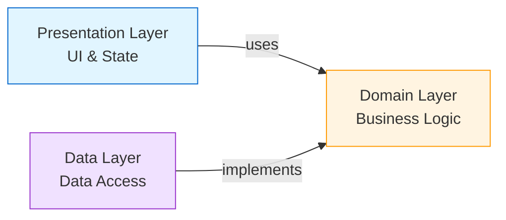

## Introduction

Clean Architecture in Softbee separates the application into three distinct layers, each with specific responsibilities and dependencies flowing inward toward the business logic. This approach ensures that business rules remain independent of frameworks, UI, and external dependencies.

<Note>
**Dependency Rule**: Source code dependencies point only inward. Inner layers know nothing about outer layers. The Domain layer is completely independent.
</Note>

## The Three Layers



## Domain Layer

The **Domain Layer** is the heart of the application. It contains business entities, business rules (use cases), and repository contracts. This layer has **zero dependencies** on Flutter or any external packages except for utility libraries like `either_dart` and `equatable`.

### Location in Codebase

```
lib/feature/{feature_name}/domain/
├── entities/        # Business objects
├── repositories/    # Repository interfaces
└── usecases/        # Business logic operations
```

### Entities

Entities are pure Dart classes representing core business concepts. They contain only data and methods that operate on that data.

**Example: Apiary Entity** (`lib/feature/apiaries/domain/entities/apiary.dart`)

```dart
class Apiary {
  final String id;
  final String userId;
  final String name;
  final String? location;
  final int? beehivesCount;
  final bool treatments;
  final DateTime? createdAt;

  Apiary({
    required this.id,
    required this.userId,
    required this.name,
    this.location,
    this.beehivesCount,
    required this.treatments,
    this.createdAt,
  });

  Apiary copyWith({
    String? id,
    String? userId,
    String? name,
    String? location,
    int? beehivesCount,
    bool? treatments,
    DateTime? createdAt,
  }) {
    return Apiary(
      id: id ?? this.id,
      userId: userId ?? this.userId,
      name: name ?? this.name,
      location: location ?? this.location,
      beehivesCount: beehivesCount ?? this.beehivesCount,
      treatments: treatments ?? this.treatments,
      createdAt: createdAt ?? this.createdAt,
    );
  }
}
```

**Example: Beehive Entity** (`lib/feature/beehive/domain/entities/beehive.dart`)

```dart
class Beehive extends Equatable {
  final String id;
  final String apiaryId;
  final int? beehiveNumber;
  final String? activityLevel;
  final String? beePopulation;
  final int? foodFrames;
  final int? broodFrames;
  final String? hiveStatus;
  final String? healthStatus;
  final String? hasProductionChamber;
  final String? observations;
  final DateTime? createdAt;
  final DateTime? updatedAt;

  const Beehive({
    required this.id,
    required this.apiaryId,
    this.beehiveNumber,
    this.activityLevel,
    this.beePopulation,
    this.foodFrames,
    this.broodFrames,
    this.hiveStatus,
    this.healthStatus,
    this.hasProductionChamber,
    this.observations,
    this.createdAt,
    this.updatedAt,
  });

  @override
  List<Object?> get props => [
    id, apiaryId, beehiveNumber, activityLevel, beePopulation,
    foodFrames, broodFrames, hiveStatus, healthStatus,
    hasProductionChamber, observations, createdAt, updatedAt,
  ];
}
```

<Accordion title="Why use Equatable?">
**Equatable** simplifies value equality comparisons. Instead of manually overriding `==` and `hashCode`, you just list the properties in `props`. This is especially useful for state management where comparing objects is frequent.
</Accordion>

### Repository Interfaces

Repositories define **contracts** for data operations without specifying implementation details. They return `Either<Failure, T>` to handle errors functionally.

**Example: Apiary Repository** (`lib/feature/apiaries/domain/repositories/apiary_repository.dart`)

```dart
abstract class ApiaryRepository {
  Future<Either<Failure, List<Apiary>>> getApiaries();
  
  Future<Either<Failure, Apiary>> createApiary(
    String userId,
    String name,
    String? location,
    int? beehivesCount,
    bool treatments,
  );
  
  Future<Either<Failure, Apiary>> updateApiary(
    String apiaryId,
    String userId,
    String? name,
    String? location,
    int? beehivesCount,
    bool? treatments,
  );
  
  Future<Either<Failure, void>> deleteApiary(String apiaryId, String userId);
}
```

**Example: Inventory Repository** (`lib/feature/inventory/domain/repositories/inventory_repository.dart`)

```dart
abstract class InventoryRepository {
  Future<Either<Failure, List<InventoryItem>>> getInventoryItems({
    required String apiaryId,
  });
  
  Future<Either<Failure, InventoryItem>> createInventoryItem(
    InventoryItem item,
  );
  
  Future<Either<Failure, void>> updateInventoryItem(InventoryItem item);
  
  Future<Either<Failure, void>> deleteInventoryItem(String itemId);
  
  Future<Either<Failure, void>> adjustInventoryQuantity(
    String itemId,
    int amount,
  );
  
  Future<Either<Failure, List<InventoryItem>>> searchInventoryItems(
    String query, {
    required String apiaryId,
  });
}
```

### Use Cases

Use cases encapsulate **single business operations**. Each use case has one responsibility, following the Single Responsibility Principle.

**Base UseCase Contract** (`lib/core/usecase/usecase.dart`)

```dart
abstract class UseCase<Type, Params> {
  Future<Either<Failure, Type>> call(Params params);
}

class NoParams {}
```

**Example: Get Apiaries Use Case** (`lib/feature/apiaries/domain/usecases/get_apiaries.dart`)

```dart
class GetApiariesUseCase implements UseCase<List<Apiary>, NoParams> {
  final ApiaryRepository repository;

  GetApiariesUseCase(this.repository);

  @override
  Future<Either<Failure, List<Apiary>>> call(NoParams params) async {
    return await repository.getApiaries();
  }
}
```

This simple use case delegates to the repository. More complex use cases might:
- Validate input parameters
- Combine multiple repository calls
- Apply business rules
- Transform data

### Error Handling with Failures

**Failure Hierarchy** (`lib/core/error/failures.dart`)

```dart
abstract class Failure {
  final String message;
  const Failure(this.message);
}

class ServerFailure extends Failure {
  const ServerFailure(super.message);
}

class CacheFailure extends Failure {
  const CacheFailure(super.message);
}

class NetworkFailure extends Failure {
  const NetworkFailure(super.message);
}

class AuthFailure extends Failure {
  const AuthFailure(super.message);
}

class InvalidInputFailure extends Failure {
  const InvalidInputFailure(super.message);
}
```

**Benefits:**
- Type-safe error handling
- Clear categorization of failures
- Forces explicit error handling
- Easy to extend with new failure types

## Data Layer

The **Data Layer** implements repository interfaces and handles data retrieval from APIs, databases, and caches. It knows about data sources but not about the UI.

### Location in Codebase

```
lib/feature/{feature_name}/data/
├── datasources/     # Remote & local data access
├── models/          # DTOs with JSON serialization
└── repositories/    # Repository implementations
```

### Data Sources

Data sources provide raw data from external sources. They're separated into **remote** (API) and **local** (storage/cache).

**Example: Apiary Remote Data Source** (`lib/feature/apiaries/data/datasources/apiary_remote_datasource.dart`)

```dart
abstract class ApiaryRemoteDataSource {
  Future<List<Apiary>> getApiaries(String token);
  Future<Apiary> createApiary(
    String token,
    String userId,
    String name,
    String? location,
    int? beehivesCount,
    bool treatments,
  );
  // ... other methods
}

class ApiaryRemoteDataSourceImpl implements ApiaryRemoteDataSource {
  final Dio httpClient;
  final AuthLocalDataSource localDataSource;

  ApiaryRemoteDataSourceImpl(this.httpClient, this.localDataSource);

  @override
  Future<List<Apiary>> getApiaries(String token) async {
    try {
      final response = await httpClient.get(
        '/api/v1/apiaries',
        options: Options(headers: {'Authorization': 'Bearer $token'}),
      );

      if (response.statusCode == 200) {
        final List<dynamic> apiariesJson = response.data;
        return apiariesJson.map((json) => Apiary.fromJson(json)).toList();
      } else {
        throw Exception(
          response.data['message'] ?? 'Error al obtener apiarios',
        );
      }
    } on DioException catch (e) {
      if (e.response != null) {
        throw Exception(
          e.response!.data['message'] ??
              'Error de red: ${e.response!.statusCode}',
        );
      } else {
        throw Exception('Error de conexión: ${e.message}');
      }
    }
  }
}
```

<Note>
Data sources throw **exceptions** on errors. The repository layer catches these and converts them to `Failure` objects.
</Note>

### Repository Implementations

Repository implementations coordinate between data sources and convert exceptions to domain failures.

**Example: Apiary Repository Implementation** (`lib/feature/apiaries/data/repositories/apiary_repository_impl.dart`)

```dart
class ApiaryRepositoryImpl implements ApiaryRepository {
  final ApiaryRemoteDataSource remoteDataSource;
  final AuthLocalDataSource localDataSource;

  ApiaryRepositoryImpl({
    required this.remoteDataSource,
    required this.localDataSource,
  });

  @override
  Future<Either<Failure, List<Apiary>>> getApiaries() async {
    try {
      final token = await localDataSource.getToken();
      if (token == null) {
        return const Left(AuthFailure('No authentication token found.'));
      }
      final result = await remoteDataSource.getApiaries(token);
      return Right(result);
    } catch (e) {
      return Left(ServerFailure(e.toString()));
    }
  }

  @override
  Future<Either<Failure, Apiary>> createApiary(
    String userId,
    String name,
    String? location,
    int? beehivesCount,
    bool treatments,
  ) async {
    try {
      final token = await localDataSource.getToken();
      if (token == null) {
        return const Left(AuthFailure('No authentication token found.'));
      }
      final result = await remoteDataSource.createApiary(
        token,
        userId,
        name,
        location,
        beehivesCount,
        treatments,
      );
      return Right(result);
    } catch (e) {
      return Left(ServerFailure(e.toString()));
    }
  }
}
```

**Key responsibilities:**
- Retrieve authentication tokens
- Call appropriate data sources
- Handle exceptions and convert to Failures
- Return Either for functional error handling

### Models vs Entities

While entities are in the Domain layer, models with JSON serialization live in the Data layer. In this codebase, entities often have `fromJson` and `toJson` methods directly, blending the distinction slightly for simplicity.

**Example: Inventory Item Model** (`lib/feature/inventory/data/models/inventory_item.dart`)

```dart
class InventoryItem {
  final String id;
  final String itemName;
  final int quantity;
  final String unit;
  final String apiaryId;
  final String? description;
  final int minimumStock;
  final DateTime createdAt;
  final DateTime updatedAt;

  factory InventoryItem.fromJson(Map<String, dynamic> json) {
    return InventoryItem(
      id: json['id']?.toString() ?? '',
      itemName: json['name']?.toString() ?? '',
      quantity: json['quantity'] as int? ?? 0,
      unit: json['unit']?.toString() ?? 'unit',
      apiaryId: json['apiary_id']?.toString() ?? '',
      description: json['description'],
      minimumStock: json['minimum_stock'] as int? ?? 0,
      createdAt: DateTime.tryParse(json['created_at']?.toString() ?? '') 
          ?? DateTime.now(),
      updatedAt: DateTime.tryParse(json['updated_at']?.toString() ?? '') 
          ?? DateTime.now(),
    );
  }

  Map<String, dynamic> toJson() {
    return {
      'id': id,
      'name': itemName,
      'quantity': quantity,
      'unit': unit,
      'apiary_id': apiaryId,
      'description': description,
      'minimum_stock': minimumStock,
      'created_at': createdAt.toIso8601String(),
      'updated_at': updatedAt.toIso8601String(),
    };
  }
}
```

## Presentation Layer

The **Presentation Layer** handles UI rendering, user interactions, and state management. It depends on the Domain layer but knows nothing about Data layer implementation details.

### Location in Codebase

```
lib/feature/{feature_name}/presentation/
├── controllers/     # State management logic
├── pages/           # Screen widgets
├── providers/       # Riverpod providers
└── widgets/         # Feature-specific UI components
```

### State Classes

State classes are immutable data structures representing UI state.

**Example: Apiaries State** (`lib/feature/apiaries/presentation/controllers/apiaries_controller.dart:13-91`)

```dart
class ApiariesState extends Equatable {
  final bool isLoading;
  final bool isCreating;
  final bool isUpdating;
  final bool isDeleting;
  final List<Apiary> allApiaries;
  final List<Apiary> filteredApiaries;
  final String searchQuery;
  final String? errorMessage;
  final String? successMessage;
  final String? errorCreating;
  final String? errorUpdating;
  final String? errorDeleting;

  const ApiariesState({
    this.isLoading = false,
    this.isCreating = false,
    this.isUpdating = false,
    this.isDeleting = false,
    this.allApiaries = const [],
    this.filteredApiaries = const [],
    this.searchQuery = '',
    this.errorMessage,
    this.successMessage,
    this.errorCreating,
    this.errorUpdating,
    this.errorDeleting,
  });

  ApiariesState copyWith({
    bool? isLoading,
    bool? isCreating,
    bool? isUpdating,
    bool? isDeleting,
    List<Apiary>? allApiaries,
    List<Apiary>? filteredApiaries,
    String? searchQuery,
    String? errorMessage,
    String? successMessage,
    bool clearError = false,
    bool clearSuccess = false,
  }) {
    return ApiariesState(
      isLoading: isLoading ?? this.isLoading,
      isCreating: isCreating ?? this.isCreating,
      allApiaries: allApiaries ?? this.allApiaries,
      filteredApiaries: filteredApiaries ?? this.filteredApiaries,
      searchQuery: searchQuery ?? this.searchQuery,
      errorMessage: clearError ? null : errorMessage ?? this.errorMessage,
      successMessage: clearSuccess 
          ? null 
          : successMessage ?? this.successMessage,
      // ...
    );
  }

  @override
  List<Object?> get props => [
    isLoading, isCreating, isUpdating, isDeleting,
    allApiaries, filteredApiaries, searchQuery,
    errorMessage, successMessage,
  ];
}
```

### Controllers (State Notifiers)

Controllers manage state and orchestrate use cases based on user actions.

**Example: Apiaries Controller** (simplified from `lib/feature/apiaries/presentation/controllers/apiaries_controller.dart`)

```dart
class ApiariesController extends StateNotifier<ApiariesState> {
  final GetApiariesUseCase getApiariesUseCase;
  final CreateApiaryUseCase createApiaryUseCase;
  final UpdateApiaryUseCase updateApiaryUseCase;
  final DeleteApiaryUseCase deleteApiaryUseCase;
  final AuthController authController;

  ApiariesController({
    required this.getApiariesUseCase,
    required this.createApiaryUseCase,
    required this.updateApiaryUseCase,
    required this.deleteApiaryUseCase,
    required this.authController,
  }) : super(const ApiariesState());

  String? get _currentUserId => authController.state.user?.id;

  Future<void> fetchApiaries() async {
    state = state.copyWith(isLoading: true, clearError: true);

    if (!_isAuthenticated()) {
      state = state.copyWith(
        isLoading: false,
        errorMessage: 'User not authenticated.',
      );
      return;
    }

    final result = await getApiariesUseCase(NoParams());

    result.fold(
      (failure) {
        state = state.copyWith(
          isLoading: false,
          errorMessage: _mapFailureToMessage(failure, 'fetching apiaries'),
        );
      },
      (allApiaries) {
        final userApiaries = allApiaries
            .where((apiary) => apiary.userId == _currentUserId)
            .toList();
        state = state.copyWith(
          isLoading: false,
          allApiaries: userApiaries,
          filteredApiaries: userApiaries,
        );
      },
    );
  }

  Future<void> createApiary(
    String name,
    String? location,
    int? beehivesCount,
    bool treatments,
  ) async {
    state = state.copyWith(isCreating: true, clearError: true);

    final params = CreateApiaryParams(
      userId: _currentUserId!,
      name: name,
      location: location,
      beehivesCount: beehivesCount,
      treatments: treatments,
    );

    final result = await createApiaryUseCase(params);

    result.fold(
      (failure) => state = state.copyWith(
        isCreating: false,
        errorCreating: _mapFailureToMessage(failure, 'creating apiary'),
      ),
      (newApiary) {
        final updatedApiaries = [...state.allApiaries, newApiary];
        state = state.copyWith(
          isCreating: false,
          allApiaries: updatedApiaries,
          filteredApiaries: updatedApiaries,
          successMessage: 'Apiary created successfully!',
        );
      },
    );
  }

  String _mapFailureToMessage(Failure failure, String operation) {
    switch (failure.runtimeType) {
      case ServerFailure:
        return 'Server Error during $operation: ${failure.message}';
      case AuthFailure:
        return 'Authentication Error during $operation: ${failure.message}';
      case NetworkFailure:
        return 'Network Error during $operation: ${failure.message}';
      default:
        return 'An unexpected error occurred during $operation.';
    }
  }
}
```

**Key responsibilities:**
- Manage UI state immutably
- Execute use cases based on user actions
- Handle Either results with fold
- Map Failures to user-friendly messages
- Update state to trigger UI rebuilds

### Providers (Dependency Injection)

Riverpod providers wire up the dependency graph and expose state to the UI.

**Example: Apiary Providers** (`lib/feature/apiaries/presentation/providers/apiary_providers.dart`)

```dart
// Data source
final apiaryRemoteDataSourceProvider = Provider<ApiaryRemoteDataSource>((ref) {
  final dio = ref.read(dioClientProvider);
  final localDataSource = ref.read(authLocalDataSourceProvider);
  return ApiaryRemoteDataSourceImpl(dio, localDataSource);
});

// Repository
final apiaryRepositoryProvider = Provider<ApiaryRepository>((ref) {
  return ApiaryRepositoryImpl(
    remoteDataSource: ref.read(apiaryRemoteDataSourceProvider),
    localDataSource: ref.read(authLocalDataSourceProvider),
  );
});

// Use cases
final getApiariesUseCaseProvider = Provider<GetApiariesUseCase>((ref) {
  return GetApiariesUseCase(ref.read(apiaryRepositoryProvider));
});

final createApiaryUseCaseProvider = Provider<CreateApiaryUseCase>((ref) {
  return CreateApiaryUseCase(ref.read(apiaryRepositoryProvider));
});

// Controller
final apiariesControllerProvider =
    StateNotifierProvider<ApiariesController, ApiariesState>((ref) {
  return ApiariesController(
    getApiariesUseCase: ref.read(getApiariesUseCaseProvider),
    createApiaryUseCase: ref.read(createApiaryUseCaseProvider),
    updateApiaryUseCase: ref.read(updateApiaryUseCaseProvider),
    deleteApiaryUseCase: ref.read(deleteApiaryUseCaseProvider),
    authController: ref.watch(authControllerProvider.notifier),
  );
});
```

**Provider hierarchy flow:**
1. Core providers (Dio client, auth storage)
2. Data source providers
3. Repository providers
4. Use case providers
5. Controller providers

### Pages and Widgets

Pages consume state from controllers and dispatch actions.

**Example pattern:**

```dart
class ApiariesPage extends ConsumerWidget {
  @override
  Widget build(BuildContext context, WidgetRef ref) {
    final state = ref.watch(apiariesControllerProvider);
    final controller = ref.read(apiariesControllerProvider.notifier);

    if (state.isLoading) {
      return LoadingIndicator();
    }

    if (state.errorMessage != null) {
      return ErrorWidget(message: state.errorMessage!);
    }

    return ListView.builder(
      itemCount: state.filteredApiaries.length,
      itemBuilder: (context, index) {
        final apiary = state.filteredApiaries[index];
        return ApiaryCard(
          apiary: apiary,
          onTap: () => controller.selectApiary(apiary.id),
        );
      },
    );
  }
}
```

## Data Flow Example

Let's trace a complete flow: **Creating an Apiary**

<Tabs>
  <Tab title="1. User Action">
    User fills out a form and taps "Create Apiary" button.
    
    ```dart
    ElevatedButton(
      onPressed: () {
        ref.read(apiariesControllerProvider.notifier).createApiary(
          name: nameController.text,
          location: locationController.text,
          beehivesCount: int.tryParse(countController.text),
          treatments: treatmentsSwitch.value,
        );
      },
      child: Text('Create'),
    )
    ```
  </Tab>
  
  <Tab title="2. Controller">
    Controller receives action, updates state, calls use case.
    
    ```dart
    Future<void> createApiary(...) async {
      state = state.copyWith(isCreating: true);
      
      final params = CreateApiaryParams(...);
      final result = await createApiaryUseCase(params);
      
      result.fold(
        (failure) => state = state.copyWith(
          isCreating: false,
          errorCreating: _mapFailureToMessage(failure),
        ),
        (newApiary) => state = state.copyWith(
          isCreating: false,
          allApiaries: [...state.allApiaries, newApiary],
        ),
      );
    }
    ```
  </Tab>
  
  <Tab title="3. Use Case">
    Use case delegates to repository.
    
    ```dart
    class CreateApiaryUseCase 
        implements UseCase<Apiary, CreateApiaryParams> {
      final ApiaryRepository repository;

      @override
      Future<Either<Failure, Apiary>> call(
        CreateApiaryParams params
      ) async {
        return await repository.createApiary(
          params.userId,
          params.name,
          params.location,
          params.beehivesCount,
          params.treatments,
        );
      }
    }
    ```
  </Tab>
  
  <Tab title="4. Repository">
    Repository gets token, calls data source, handles errors.
    
    ```dart
    @override
    Future<Either<Failure, Apiary>> createApiary(...) async {
      try {
        final token = await localDataSource.getToken();
        if (token == null) {
          return const Left(
            AuthFailure('No authentication token found.')
          );
        }
        
        final result = await remoteDataSource.createApiary(
          token, userId, name, location, beehivesCount, treatments
        );
        
        return Right(result);
      } catch (e) {
        return Left(ServerFailure(e.toString()));
      }
    }
    ```
  </Tab>
  
  <Tab title="5. Data Source">
    Data source makes HTTP request.
    
    ```dart
    @override
    Future<Apiary> createApiary(...) async {
      final response = await httpClient.post(
        '/api/v1/apiaries',
        data: {
          'user_id': userId,
          'name': name,
          'location': location,
          'beehives_count': beehivesCount,
          'treatments': treatments,
        },
        options: Options(
          headers: {'Authorization': 'Bearer $token'}
        ),
      );

      if (response.statusCode == 201) {
        return Apiary.fromJson(response.data);
      } else {
        throw Exception('Error al crear apiario');
      }
    }
    ```
  </Tab>
  
  <Tab title="6. UI Update">
    State change triggers rebuild.
    
    ```dart
    // Consumer widget automatically rebuilds
    final state = ref.watch(apiariesControllerProvider);
    
    if (state.isCreating) {
      return CircularProgressIndicator();
    }
    
    if (state.successMessage != null) {
      showSnackbar(state.successMessage!);
    }
    
    return ApiariesList(apiaries: state.allApiaries);
    ```
  </Tab>
</Tabs>

## Testing Strategy

Clean Architecture enables comprehensive testing at each layer:

<CardGroup cols={3}>
  <Card title="Unit Tests" icon="flask">
    Test entities, use cases, and business logic in isolation
  </Card>
  <Card title="Integration Tests" icon="plug">
    Test repository implementations with mocked data sources
  </Card>
  <Card title="Widget Tests" icon="mobile">
    Test UI with mocked controllers and state
  </Card>
</CardGroup>

**Example: Testing a Use Case**

```dart
void main() {
  late GetApiariesUseCase useCase;
  late MockApiaryRepository mockRepository;

  setUp(() {
    mockRepository = MockApiaryRepository();
    useCase = GetApiariesUseCase(mockRepository);
  });

  test('should return list of apiaries from repository', () async {
    // Arrange
    final apiaries = [
      Apiary(id: '1', userId: 'user1', name: 'Test Apiary', treatments: false),
    ];
    when(mockRepository.getApiaries())
        .thenAnswer((_) async => Right(apiaries));

    // Act
    final result = await useCase(NoParams());

    // Assert
    expect(result, Right(apiaries));
    verify(mockRepository.getApiaries());
    verifyNoMoreInteractions(mockRepository);
  });
}
```

## Benefits Summary

<Accordion title="Separation of Concerns">
Each layer has clear responsibilities. Domain contains business rules, Data handles external dependencies, Presentation manages UI state.
</Accordion>

<Accordion title="Testability">
Business logic can be tested without UI or database. Mock repositories for use case tests, mock use cases for controller tests.
</Accordion>

<Accordion title="Independence">
Domain layer is independent of frameworks. You can change from Riverpod to Bloc, or from Dio to http package, without touching business logic.
</Accordion>

<Accordion title="Maintainability">
Clear structure makes code easy to navigate and modify. New developers can quickly understand the architecture.
</Accordion>

## Next Steps

<CardGroup cols={2}>
  <Card title="Application Architecture" icon="sitemap" href="/concepts/architecture">
    Understand the overall app structure and design decisions
  </Card>
  <Card title="Features Overview" icon="grid-2" href="/concepts/features-overview">
    Explore all features in the application
  </Card>
</CardGroup>
