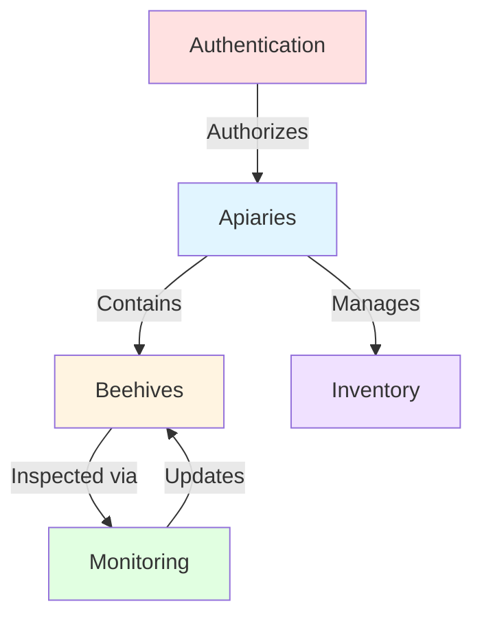

## Introduction

Softbee is a comprehensive beekeeping management SaaS application that helps beekeepers manage their apiaries, track beehive health, monitor inspections, manage inventory, and handle authentication. Each feature is built as a self-contained module following Clean Architecture principles.

## Feature Modules

The application consists of five core feature modules:

<CardGroup cols={2}>
  <Card title="Authentication" icon="lock">
    User registration, login, password recovery, and session management
  </Card>
  <Card title="Apiaries" icon="location-dot">
    Manage multiple apiaries with location tracking and settings
  </Card>
  <Card title="Beehives" icon="hexagon">
    Track individual beehives with health metrics and status
  </Card>
  <Card title="Monitoring" icon="clipboard-check">
    Conduct inspections with customizable questions and responses
  </Card>
  <Card title="Inventory" icon="boxes-stacked">
    Manage equipment, supplies, and materials with stock tracking
  </Card>
</CardGroup>

## Authentication Feature

**Location:** `lib/feature/auth/`

The authentication feature handles user identity, session management, and access control across the application.

### Core Entities

**User** (`lib/feature/auth/core/entities/user.dart`)

```dart
class User {
  final String id;
  final String email;
  final String username;
  final bool isVerified;
  final bool isActive;

  const User({
    required this.id,
    required this.email,
    required this.username,
    required this.isVerified,
    required this.isActive,
  });
}
```

### Key Features

<Accordion title="User Registration">
New users can create accounts with email and password. The system validates input and creates user profiles.

**Use Case:** `RegisterUseCase`
- Validates email format and password strength
- Checks for existing users
- Creates new user account
- Returns user data or registration failure
</Accordion>

<Accordion title="Login & Session Management">
Users authenticate with credentials and receive a JWT token for subsequent requests.

**Use Case:** `LoginUseCase`
- Validates credentials
- Retrieves JWT token from server
- Stores token locally for session persistence
- Returns user data with authentication state

**Use Case:** `CheckAuthStatusUseCase`
- Checks for existing token
- Validates token expiration
- Restores user session on app launch
</Accordion>

<Accordion title="Password Recovery">
Users can reset forgotten passwords via email verification.

**Pages:**
- `ForgotPasswordPage`: Request password reset
- `ResetPasswordPage`: Set new password with reset token
</Accordion>

<Accordion title="User Management">
Administrators can view and manage user accounts.

**Page:** `UserManagementPage`
- View all users
- Update user status
- Manage permissions
</Accordion>

### Data Sources

**Remote Data Source:** `AuthRemoteDataSource`
- POST `/api/v1/auth/register` - Create new user
- POST `/api/v1/auth/login` - Authenticate user
- POST `/api/v1/auth/forgot-password` - Request password reset
- POST `/api/v1/auth/reset-password` - Reset password with token

**Local Data Source:** `AuthLocalDataSource`
- Store/retrieve JWT token using secure storage
- Persist user session across app restarts
- Clear token on logout

### State Management

**AuthController** manages authentication state:

```dart
class AuthState {
  final bool isAuthenticated;
  final User? user;
  final String? token;
  final bool isLoading;
  final String? errorMessage;
}
```

**Key methods:**
- `login(email, password)` - Authenticate user
- `register(username, email, password)` - Create account
- `logout()` - Clear session and token
- `checkAuthStatus()` - Restore session on app start

## Apiaries Feature

**Location:** `lib/feature/apiaries/`

Apiaries are the primary organizational unit in beekeeping. This feature manages multiple apiary locations with their associated settings.

### Core Entity

**Apiary** (`lib/feature/apiaries/domain/entities/apiary.dart`)

```dart
class Apiary {
  final String id;
  final String userId;
  final String name;
  final String? location;
  final int? beehivesCount;
  final bool treatments;
  final DateTime? createdAt;
}
```

### Key Features

<Tabs>
  <Tab title="CRUD Operations">
    **Create, Read, Update, Delete** apiaries
    
    **Use Cases:**
    - `GetApiariesUseCase` - Fetch all user's apiaries
    - `CreateApiaryUseCase` - Add new apiary
    - `UpdateApiaryUseCase` - Modify apiary details
    - `DeleteApiaryUseCase` - Remove apiary
    
    ```dart
    // Creating an apiary
    final params = CreateApiaryParams(
      userId: currentUserId,
      name: 'Mountain Apiary',
      location: 'North Ridge, 45.123, -73.456',
      beehivesCount: 10,
      treatments: true,
    );
    
    final result = await createApiaryUseCase(params);
    ```
  </Tab>
  
  <Tab title="Search & Filter">
    **Search apiaries** by name with real-time filtering
    
    ```dart
    void applyFilter(String query) {
      final lowerCaseQuery = query.toLowerCase();
      final filtered = state.allApiaries.where((apiary) {
        return apiary.name.toLowerCase().contains(lowerCaseQuery);
      }).toList();
      
      state = state.copyWith(
        searchQuery: query, 
        filteredApiaries: filtered
      );
    }
    ```
  </Tab>
  
  <Tab title="Apiary Settings">
    **Configure apiary-specific settings**
    
    - Treatment schedules
    - Location coordinates
    - Beehive capacity
    - Custom notes
    
    **Page:** `ApiarySettingsPage`
  </Tab>
  
  <Tab title="Related Pages">
    Each apiary has associated pages:
    
    - `HivesPage` - View beehives in this apiary
    - `InventoryPage` - Manage apiary inventory
    - `ReportsPage` - Generate apiary reports
    - `HistoryPage` - View apiary activity history
  </Tab>
</Tabs>

### Presentation Components

**Pages:**
- Main apiary dashboard with list view
- `ApiarySettingsPage` - Configure apiary
- `HivesPage` - View beehives in apiary
- `InventoryPage` - Manage inventory
- `ReportsPage` - Analytics and reports

**Widgets:**
- `ApiaryCard` - Display apiary summary
- `ApiaryFormDialog` - Create/edit apiary form
- `ApiariesMenu` - Navigation menu for apiary actions

### State Structure

```dart
class ApiariesState {
  final bool isLoading;
  final bool isCreating;
  final bool isUpdating;
  final bool isDeleting;
  final List<Apiary> allApiaries;
  final List<Apiary> filteredApiaries;
  final String searchQuery;
  final String? errorMessage;
  final String? successMessage;
}
```

## Beehives Feature

**Location:** `lib/feature/beehive/`

Individual beehive tracking with health metrics, status monitoring, and detailed observations.

### Core Entity

**Beehive** (`lib/feature/beehive/domain/entities/beehive.dart`)

```dart
class Beehive extends Equatable {
  final String id;
  final String apiaryId;
  final int? beehiveNumber;
  final String? activityLevel;
  final String? beePopulation;
  final int? foodFrames;
  final int? broodFrames;
  final String? hiveStatus;
  final String? healthStatus;
  final String? hasProductionChamber;
  final String? observations;
  final DateTime? createdAt;
  final DateTime? updatedAt;
}
```

### Key Attributes

<CardGroup cols={3}>
  <Card title="Activity Level" icon="chart-line">
    Low, Medium, High - Tracks hive activity
  </Card>
  <Card title="Population" icon="users">
    Small, Medium, Large - Bee colony size
  </Card>
  <Card title="Health Status" icon="heart-pulse">
    Healthy, At Risk, Unhealthy
  </Card>
</CardGroup>

### Health Metrics

The beehive entity tracks several critical health indicators:

**Frame Counts:**
- **Food Frames**: Frames with honey/nectar stores
- **Brood Frames**: Frames with eggs, larvae, and pupae

**Status Indicators:**
- **Hive Status**: Active, Inactive, Queenless, etc.
- **Health Status**: Overall colony health
- **Production Chamber**: Whether a honey super is installed

**Observations:**
Free-text field for inspection notes and observations

### Enums

The feature includes enums for standardized status values:

**Location:** `lib/feature/beehive/domain/enums/`
- Activity levels
- Population sizes
- Health statuses
- Hive statuses

### Use Cases

Beehive operations include:

- **Get Beehives** - Fetch all beehives for an apiary
- **Create Beehive** - Add new beehive to apiary
- **Update Beehive** - Modify beehive data
- **Delete Beehive** - Remove beehive from tracking

### Data Flow

**Remote Data Source:** `BeehiveRemoteDataSource`
- GET `/api/v1/beehives?apiary_id={id}` - List beehives
- POST `/api/v1/beehives` - Create beehive
- PUT `/api/v1/beehives/{id}` - Update beehive
- DELETE `/api/v1/beehives/{id}` - Delete beehive

**Repository:** `BeehiveRepository`
- Handles authentication
- Manages error conversion
- Returns `Either<Failure, Beehive>`

## Monitoring Feature

**Location:** `lib/feature/monitoring/`

The monitoring feature enables customizable inspection workflows with dynamic question sets.

### Core Entity

**Pregunta (Question)** (`lib/feature/monitoring/domain/entities/question_model.dart`)

```dart
class Pregunta extends Equatable {
  final String id;
  final String apiarioId;
  final String texto;              // Question text
  final String tipoRespuesta;      // Question type
  final String? categoria;         // Category
  final bool obligatoria;          // Required flag
  final List<String>? opciones;    // Options for choice questions
  final int? min;                  // Min value for numeric
  final int? max;                  // Max value for numeric
  final int orden;                 // Display order
  final bool activa;               // Active status
}
```

### Question Types

The monitoring system supports multiple question types:

<Tabs>
  <Tab title="Text">
    **Free-text responses**
    
    Users can enter any text response.
    
    **Example:**
    - "Describe the colony's behavior"
    - "Additional observations"
  </Tab>
  
  <Tab title="Numeric">
    **Numeric input with optional min/max**
    
    Useful for counts and measurements.
    
    **Example:**
    - "Number of frames with brood" (min: 0, max: 10)
    - "Temperature (°C)" (min: -10, max: 50)
  </Tab>
  
  <Tab title="Choice">
    **Multiple choice from predefined options**
    
    Options stored in `opciones` array.
    
    **Example:**
    - "Queen seen?" (options: ["Yes", "No", "Unknown"])
    - "Activity level" (options: ["Low", "Medium", "High"])
  </Tab>
  
  <Tab title="Rating">
    **Numeric rating scale**
    
    Used for subjective assessments.
    
    **Example:**
    - "Overall hive health" (1-5 scale)
    - "Beekeeper confidence" (1-10 scale)
  </Tab>
</Tabs>

### Customization

**Apiary-Specific Questions:**
Questions are scoped to individual apiaries (`apiarioId`), allowing different inspection protocols per location.

**Categorization:**
Questions can be grouped by category:
- Colony Health
- Queen Status
- Food Stores
- Pest/Disease Indicators
- Equipment Condition

**Display Order:**
The `orden` field controls question sequence during inspections.

### Workflow

1. **Define Questions** - Set up inspection checklist for apiary
2. **Conduct Inspection** - Answer questions for each beehive
3. **Record Responses** - Store inspection data
4. **Review History** - Analyze trends over time

## Inventory Feature

**Location:** `lib/feature/inventory/`

Track equipment, supplies, and materials with stock levels and low-stock alerts.

### Core Model

**InventoryItem** (`lib/feature/inventory/data/models/inventory_item.dart`)

```dart
class InventoryItem {
  final String id;
  final String itemName;
  final int quantity;
  final String unit;
  final String apiaryId;
  final String? description;
  final int minimumStock;
  final DateTime createdAt;
  final DateTime updatedAt;
}
```

### Key Features

<Accordion title="Inventory Management">
**CRUD operations for inventory items**

- Create new items with initial quantity
- Update item details and quantities
- Delete obsolete items
- View all items for an apiary

**Repository Methods:**
```dart
Future<Either<Failure, List<InventoryItem>>> getInventoryItems({
  required String apiaryId,
});

Future<Either<Failure, InventoryItem>> createInventoryItem(
  InventoryItem item,
);

Future<Either<Failure, void>> updateInventoryItem(InventoryItem item);

Future<Either<Failure, void>> deleteInventoryItem(String itemId);
```
</Accordion>

<Accordion title="Quantity Adjustments">
**Track inventory changes over time**

Adjust quantities without replacing entire item:

```dart
Future<Either<Failure, void>> adjustInventoryQuantity(
  String itemId,
  int amount,  // Positive = add, negative = subtract
);
```

Record inventory exits with accountability:

```dart
Future<Either<Failure, void>> recordInventoryExit({
  required String itemId,
  required int quantity,
  required String person,  // Who took the items
});
```
</Accordion>

<Accordion title="Search & Analytics">
**Find items and analyze stock levels**

**Search:**
```dart
Future<Either<Failure, List<InventoryItem>>> searchInventoryItems(
  String query, {
  required String apiaryId,
});
```

**Low Stock Alerts:**
```dart
Future<Either<Failure, List<InventoryItem>>> getLowStockItems({
  required String apiaryId,
});
```

Items where `quantity <= minimumStock` are flagged.

**Summary Statistics:**
```dart
Future<Either<Failure, Map<String, dynamic>>> getInventorySummary({
  required String apiaryId,
});
```

Returns total items, total value, low stock count, etc.
</Accordion>

### Unit Types

Inventory items support various units:
- **Pieces** - Individual items (frames, boxes, tools)
- **Liters** - Liquid volumes (syrup, medications)
- **Kilograms** - Weight-based (sugar, wax)
- **Boxes** - Bulk packaging
- **Custom** - User-defined units

### Common Inventory Items

**Equipment:**
- Frames (various types)
- Hive boxes (deeps, mediums, shallows)
- Feeders
- Queen excluders

**Supplies:**
- Sugar (for syrup)
- Medications/treatments
- Foundation wax
- Protective gear

**Tools:**
- Hive tools
- Smokers
- Brushes
- Extractors

## Feature Integration

Features work together to provide comprehensive apiary management:



### Example Workflow

1. **User logs in** (Authentication)
2. **Selects an apiary** (Apiaries)
3. **Views beehives** in that apiary (Beehives)
4. **Conducts inspection** with custom questions (Monitoring)
5. **Updates beehive health** based on findings (Beehives)
6. **Records treatment usage** from inventory (Inventory)

## Shared Core Components

All features leverage shared core utilities:

### Error Handling

**Failure Classes** (`lib/core/error/failures.dart`)

```dart
abstract class Failure {
  final String message;
  const Failure(this.message);
}

class ServerFailure extends Failure { }
class AuthFailure extends Failure { }
class NetworkFailure extends Failure { }
class InvalidInputFailure extends Failure { }
```

Every operation returns `Either<Failure, T>` for type-safe error handling.

### Use Case Base Class

**UseCase** (`lib/core/usecase/usecase.dart`)

```dart
abstract class UseCase<Type, Params> {
  Future<Either<Failure, Type>> call(Params params);
}

class NoParams {}
```

All business operations implement this interface.

### Networking

**DioClient** (`lib/core/network/dio_client.dart`)

Centralized HTTP client configuration:
- Platform-specific base URLs
- Timeout settings
- Default headers
- Provided via Riverpod

### Routing

**AppRouter** (`lib/core/router/app_router.dart`)

Declarative navigation using go_router:
- Route definitions
- Authentication guards
- Deep linking support

### Widgets

**Shared Components** (`lib/core/widgets/`)

Reusable UI components:
- `DashboardMenu` - Main navigation
- `HoneycombLoader` - Custom loading indicator
- `MenuInfoApiario` - Apiary info display

## Technology Stack

<CardGroup cols={2}>
  <Card title="Flutter" icon="mobile">
    Cross-platform UI framework (iOS, Android, Web)
  </Card>
  <Card title="Riverpod" icon="arrows-spin">
    State management with compile-time safety
  </Card>
  <Card title="Dio" icon="wifi">
    HTTP client for API communication
  </Card>
  <Card title="Either Dart" icon="code-branch">
    Functional error handling with Either type
  </Card>
  <Card title="Equatable" icon="equals">
    Value equality for entities and states
  </Card>
  <Card title="Go Router" icon="route">
    Declarative routing and navigation
  </Card>
</CardGroup>

## Feature Expansion

The modular architecture makes it easy to add new features:

**Potential future features:**
- **Honey Production Tracking** - Record harvests and yields
- **Financial Management** - Track expenses and revenue
- **Weather Integration** - Correlate inspections with weather data
- **Queen Breeding** - Manage queen rearing operations
- **Collaboration** - Share apiaries with other beekeepers
- **Analytics Dashboard** - Advanced reporting and insights

Each new feature would follow the same Clean Architecture structure:
```
lib/feature/new_feature/
├── domain/
│   ├── entities/
│   ├── repositories/
│   └── usecases/
├── data/
│   ├── datasources/
│   └── repositories/
└── presentation/
    ├── controllers/
    ├── pages/
    ├── providers/
    └── widgets/
```

## Best Practices

When working with features:

<Note>
**Single Responsibility** - Each feature handles one business domain
</Note>

<Note>
**Loose Coupling** - Features communicate through well-defined interfaces
</Note>

<Note>
**High Cohesion** - Related functionality stays together within a feature
</Note>

<Note>
**Dependency Inversion** - Depend on abstractions, not concrete implementations
</Note>

## Next Steps

<CardGroup cols={2}>
  <Card title="Application Architecture" icon="sitemap" href="/concepts/architecture">
    Understand the overall app structure
  </Card>
  <Card title="Clean Architecture" icon="layer-group" href="/concepts/clean-architecture">
    Deep dive into Domain, Data, and Presentation layers
  </Card>
</CardGroup>
