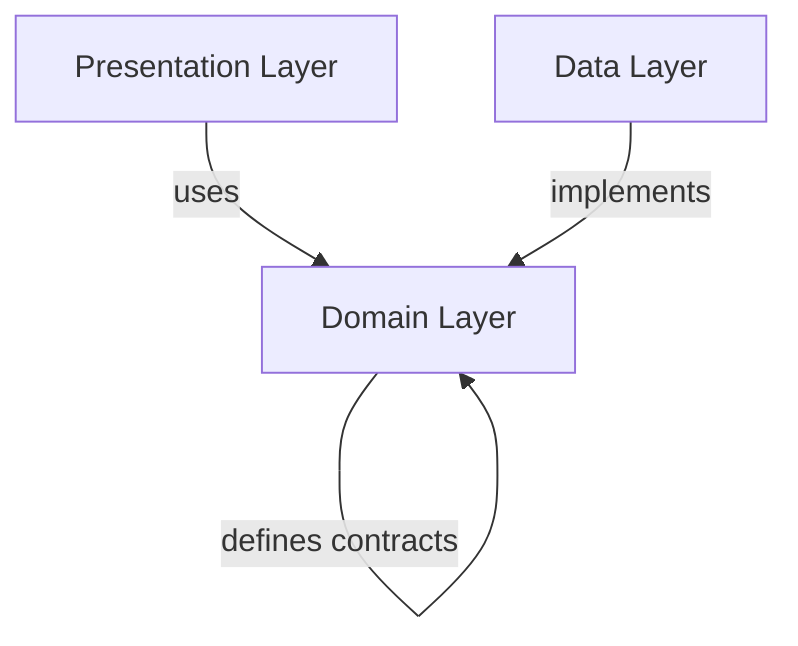

## Overview

Softbee follows **Clean Architecture** principles with clear separation between data, domain, and presentation layers. The project is organized into core utilities and feature modules.

## Root Structure

```
lib/
├── core/           # Shared utilities and configurations
├── feature/        # Feature modules
└── main.dart       # Application entry point
```

## Core Directory

The `core/` directory contains shared code used across all features:

```
core/
├── error/          # Error handling and failures
├── network/        # HTTP client configuration
├── pages/          # Shared pages (landing, 404)
├── router/         # Navigation configuration
├── services/       # Cross-cutting services
├── theme/          # UI theme and colors
├── usecase/        # Base use case class
└── widgets/        # Reusable UI components
```

### Key Core Files

<CodeGroup>

```dart lib/core/error/failures.dart
abstract class Failure {
  final String message;
  const Failure(this.message);
}

class ServerFailure extends Failure {
  const ServerFailure(super.message);
}

class NetworkFailure extends Failure {
  const NetworkFailure(super.message);
}

class AuthFailure extends Failure {
  const AuthFailure(super.message);
}
```

```dart lib/core/usecase/usecase.dart
import 'package:either_dart/either.dart';

abstract class UseCase<Type, Params> {
  Future<Either<Failure, Type>> call(Params params);
}

class NoParams {}
```

</CodeGroup>

## Feature Modules

Each feature follows the same layered structure:

```
feature/
├── apiaries/       # Apiary management
├── auth/           # Authentication
├── beehive/        # Beehive tracking
├── inventory/      # Inventory management
└── monitoring/     # Hive monitoring
```

### Clean Architecture Layers

Every feature is organized into three layers:

#### 1. Domain Layer (Business Logic)

```
feature/apiaries/domain/
├── entities/           # Pure business objects
│   └── apiary.dart
├── repositories/       # Abstract repository contracts
│   └── apiary_repository.dart
└── usecases/          # Business use cases
    ├── get_apiaries.dart
    ├── create_apiary_usecase.dart
    ├── update_apiary_usecase.dart
    └── delete_apiary_usecase.dart
```

<Note>
Domain entities are pure Dart classes with no Flutter or external dependencies. They represent core business concepts.
</Note>

#### 2. Data Layer (Implementation)

```
feature/apiaries/data/
├── datasources/        # Data source implementations
│   └── apiary_remote_datasource.dart
└── repositories/       # Repository implementations
    └── apiary_repository_impl.dart
```

**Example Entity:**

```dart lib/feature/apiaries/domain/entities/apiary.dart
class Apiary {
  final String id;
  final String userId;
  final String name;
  final String? location;
  final int? beehivesCount;
  final bool treatments;
  final DateTime? createdAt;

  Apiary({
    required this.id,
    required this.userId,
    required this.name,
    this.location,
    this.beehivesCount,
    required this.treatments,
    this.createdAt,
  });

  factory Apiary.fromJson(Map<String, dynamic> json) {
    return Apiary(
      id: json['id'].toString(),
      userId: json['user_id'],
      name: json['name'],
      location: json['location'],
      beehivesCount: json['beehives_count'],
      treatments: json['treatments'] ?? false,
      createdAt: json['created_at'] != null
          ? DateFormat("EEE, dd MMM yyyy HH:mm:ss 'GMT'")
              .parse(json['created_at'])
          : null,
    );
  }
}
```

#### 3. Presentation Layer (UI)

```
feature/apiaries/presentation/
├── controllers/        # State management controllers
│   └── apiaries_controller.dart
├── pages/             # Screen widgets
│   ├── apiary_settings_page.dart
│   ├── history_page.dart
│   └── hives_page.dart
├── providers/         # Riverpod providers
│   └── apiary_providers.dart
└── widgets/           # Feature-specific widgets
    ├── apiary_card.dart
    └── apiary_form_dialog.dart
```

## Feature Examples

### Authentication Feature Structure

The auth feature has a slightly different structure with additional organization:

```
feature/auth/
├── core/               # Auth domain layer
│   ├── entities/      # User entity
│   ├── repositories/  # Auth repository contract
│   └── usecase/       # Login, register, logout use cases
├── data/              # Auth data layer
│   ├── datasources/   # Remote and local data sources
│   └── repositories/  # Repository implementation
└── presentation/       # Auth UI layer
    ├── controllers/   # Auth state controllers
    ├── pages/         # Login, register pages
    ├── providers/     # Auth providers
    ├── router/        # Auth-specific routes
    └── widgets/       # Auth UI components
```

## Dependency Flow

<Warning>
Dependencies flow inward: **Presentation → Domain ← Data**

- Presentation depends on Domain
- Data depends on Domain
- Domain depends on nothing (pure business logic)
</Warning>



## Main Entry Point

```dart lib/main.dart
import 'package:flutter/material.dart';
import 'package:flutter_riverpod/flutter_riverpod.dart';
import 'core/router/app_router.dart';

void main() {
  runApp(const ProviderScope(child: MyApp()));
}

class MyApp extends ConsumerWidget {
  const MyApp({super.key});

  @override
  Widget build(BuildContext context, WidgetRef ref) {
    final router = ref.watch(appRouterProvider);

    return MaterialApp.router(
      debugShowCheckedModeBanner: false,
      routerConfig: router,
    );
  }
}
```

<Note>
The app is wrapped in `ProviderScope` to enable Riverpod state management throughout the application.
</Note>

## Best Practices

<Accordion title="File Naming Conventions">
- **Entities**: `entity_name.dart` (e.g., `apiary.dart`, `user.dart`)
- **Use Cases**: `action_entity_usecase.dart` (e.g., `create_apiary_usecase.dart`)
- **Controllers**: `feature_controller.dart` (e.g., `apiaries_controller.dart`)
- **Pages**: `descriptive_page.dart` (e.g., `apiary_settings_page.dart`)
- **Providers**: `feature_providers.dart` (e.g., `apiary_providers.dart`)
</Accordion>

<Accordion title="Feature Independence">
Each feature should be as independent as possible:
- Minimize cross-feature dependencies
- Share code through `core/` when needed
- Features communicate via shared domain entities
</Accordion>

<Accordion title="Layer Separation">
- Never import presentation code into domain
- Never import data implementations into domain
- Keep business logic in use cases, not controllers
</Accordion>

## Next Steps

<CardGroup cols={2}>
  <Card title="State Management" icon="arrows-rotate" href="/development/state-management">
    Learn how Riverpod manages application state
  </Card>
  <Card title="Routing" icon="route" href="/development/routing">
    Understand GoRouter navigation setup
  </Card>
  <Card title="Networking" icon="network-wired" href="/development/networking">
    Explore API integration with Dio
  </Card>
  <Card title="Testing" icon="vial" href="/development/testing">
    Testing strategies for Clean Architecture
  </Card>
</CardGroup>
